# ỨNG DỤNG JOB FINDER
### Hỗ trợ tìm kiếm việc làm và tuyển dụng

---

**Lớp học phần:** 420300362101  
**Giảng viên hướng dẫn:** Võ Văn Hải  
**Sinh viên thực hiện:** Huỳnh Hoàng Phúc  
**MSSV:** 21036541
---

## 📚 Tài Liệu Báo Cáo
- Word: [21036541_HuynhHoangPhuc_Report.docx](document/21036541_HuynhHoangPhuc_Report.docx)
- PowerPoint: [Slides Job Finder.pptx](Slides Job Finder.pptx)

---
# Job Finder

Job Finder là một ứng dụng web được phát triển nhằm kết nối hiệu quả giữa ứng viên và nhà tuyển dụng. Hệ thống cung cấp các chức năng quản lý thông tin, tìm kiếm, gợi ý và hỗ trợ các bên liên quan, giúp tối ưu hóa quy trình tuyển dụng.

---

## 🎯 Mục Tiêu
- Tạo nền tảng giúp ứng viên và nhà tuyển dụng dễ dàng kết nối.
- Cung cấp các tính năng quản lý thông tin, gợi ý kỹ năng, tìm kiếm ứng viên và công việc.
- Hỗ trợ gửi thông báo qua email, nâng cao trải nghiệm người dùng.

---

## 💻 Công Nghệ Sử Dụng

- **Ngôn ngữ lập trình**: Java, HTML, CSS, JavaScript.
- **Backend Framework**: Spring Boot (Java).
- **Template Engine**: Thymeleaf.
- **Cơ sở dữ liệu**: MariaDB.
- **ORM**: JPA/Hibernate.
- **Giao diện**: Bootstrap.
- **Gửi email**: JavaMail.
- **Quản lý phụ thuộc**: Maven hoặc Gradle.
- **Quản lý phiên bản**: Git.

---

## 🔑 Chức Năng Chính

### 1. Quản lý ứng viên (Candidate)
- **Thêm, sửa, xem thông tin ứng viên**: Tên, ngày sinh, địa chỉ, kỹ năng, v.v.
- **Gợi ý kỹ năng**: Đưa ra kỹ năng cần cải thiện dựa trên hồ sơ.
- **Tìm kiếm ứng viên**: Lọc ứng viên dựa trên tên, kỹ năng, địa chỉ, v.v.

### 2. Quản lý công việc (Jobs)
- **Thêm, sửa, xem thông tin công việc**: Tên công việc, yêu cầu, mức lương, v.v.
- **Tìm kiếm công việc**: Dựa trên kỹ năng, từ khóa, công ty.

### 3. Quản lý công ty (Company)
- **Thêm, sửa, xem thông tin công ty**: Tên, địa chỉ, mô tả, danh sách công việc.
- **Gợi ý ứng viên phù hợp**: Phân tích yêu cầu và gợi ý ứng viên.
- **Gửi email**: Thông báo cơ hội việc làm.

### 4. Tìm kiếm và gợi ý
- **Tìm kiếm**: Ứng viên và công việc dựa trên các tiêu chí cụ thể.
- **Gợi ý**: Công việc phù hợp cho ứng viên và ứng viên phù hợp cho nhà tuyển dụng.

### 5. Gửi email
- **Thông báo cơ hội việc làm**: Tùy chỉnh nội dung email để gửi đến ứng viên.

---

### 📊 Sơ Đồ Database Diagram

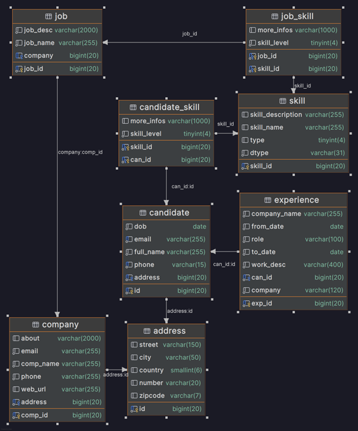

---

## 🚀 Giao Diện Ứng Dụng
# 🏠 **Trang chủ**

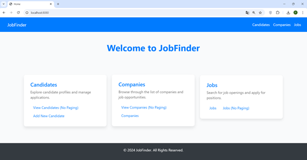

# 🧑‍💼 **Candidates**
**🖥️ Giao diện chính Candidates**
- Đây là giao diện quản lý danh sách ứng viên, hiển thị toàn bộ thông tin cơ bản của các ứng viên.

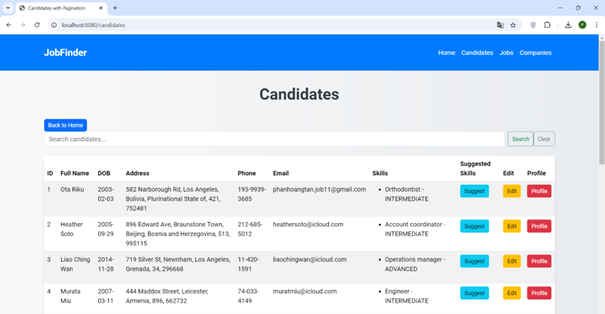
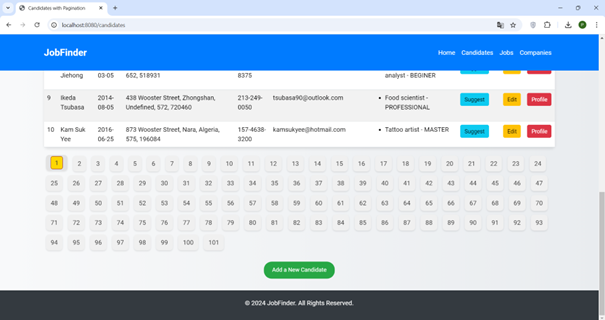

**🔍 Giao diện tìm kiếm thông tin Candidates**

- Giao diện cho phép tìm kiếm ứng viên dựa trên các tiêu chí như tên, kỹ năng, địa chỉ hoặc thông tin liên lạc.
- Kết quả tìm kiếm sẽ được hiển thị ngay sau khi nhấn nút `Search`.
- Nút `Clear` giúp xóa bộ lọc và hiển thị lại toàn bộ danh sách ứng viên.

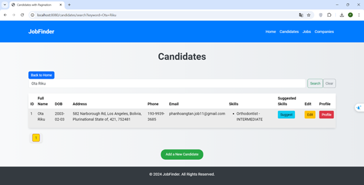

**➕ Giao diện thêm mới một ứng viên**

- Người dùng có thể thêm thông tin ứng viên mới bao gồm name, date of birth, phone, email, address, skills
- Nhấn nút `Add Candidate` để lưu thông tin mới.
- Nút `Back to List` để quay lại danh sách ứng viên.
- Sau khi thêm mới, hệ thống sẽ tự động chuyển về trang danh sách ứng viên.

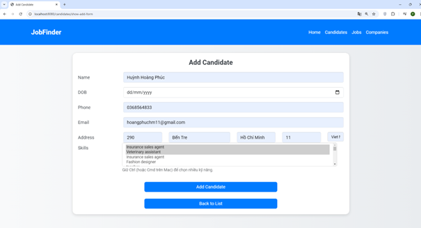

**📋 Giao diện các kỹ năng được đề xuất của một ứng viên**

- Hiển thị danh sách các kỹ năng mà hệ thống đề xuất để ứng viên cải thiện hoặc bổ sung.
- Nút `View Jobs` để xem danh sách công việc phù hợp với kỹ năng đó.

**✏️ Giao diện cập nhật thông tin của một ứng viên**

- Người dùng có thể chỉnh sửa các thông tin đã lưu của ứng viên, đảm bảo dữ liệu luôn chính xác.
- Nhấn nút `Update Candidate` để lưu thông tin đã chỉnh sửa.
- Nút `Back to List` để quay lại danh sách ứng viên.
- Sau khi cập nhật, hệ thống sẽ tự động chuyển về trang danh sách ứng viên.

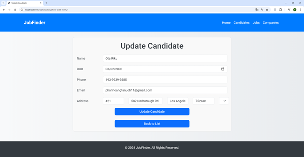

**📄 Giao diện thông tin chi tiết của một ứng viên**

- Giao diện hiển thị thông tin chi tiết của một ứng viên, bao gồm tên, ngày sinh, địa chỉ, kỹ năng, và các thông tin liên quan khác.

**💼 Giao diện đề xuất công việc dựa vào kỹ năng của một ứng viên**

- Giao diện cung cấp danh sách các công việc phù hợp với kỹ năng và hồ sơ của ứng viên.
- Để xem chi tiết công việc, người dùng có thể nhấn vào nút `View Company` để xem thông tin chi tiết về công ty tuyển dụng.

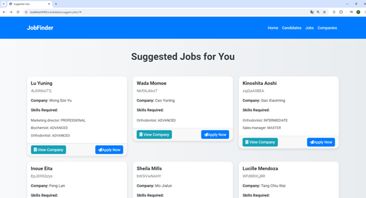

# 💼 **Jobs**
**🖥️ Giao diện chính Jobs**

- Đây là giao diện chính hiển thị danh sách công việc đang tuyển dụng với các thông tin cơ bản như tên công việc, công ty và các kĩ năng yêu cầu.
- Người dùng có thể nhấn vào nút `View` để xem chi tiết công việc.
- Để xem thông tin chi tiết về công ty tuyển dụng, người dùng có thể nhấn vào nút `View Company`.
- Nút `Edit` để chỉnh sửa thông tin công việc.

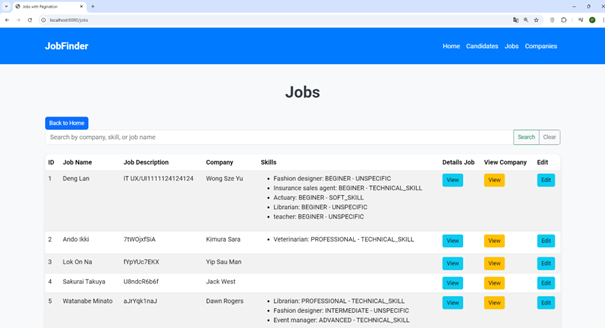
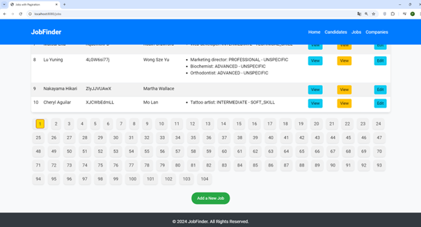

**➕ Giao diện thêm thông tin của một công việc**

- Nhà tuyển dụng có thể nhập chi tiết thông tin công việc mới bao gồm mô tả, yêu cầu kỹ năng.
- Sau khi nhập đầy đủ thông tin, nhấn nút `Save Job` để lưu thông tin và thêm công việc vào danh sách.

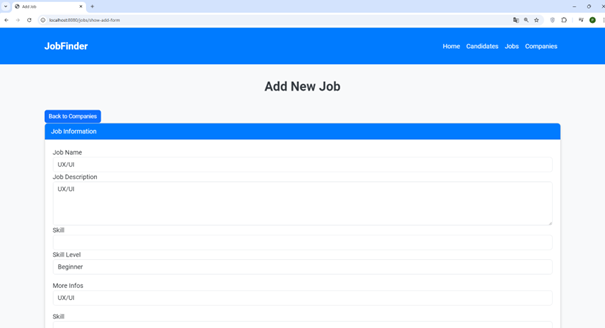
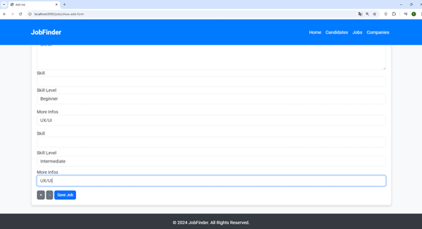

**🔍 Giao diện tìm kiếm thông tin Jobs**

- Cho phép tìm kiếm công việc dựa trên từ khóa, kỹ năng, hoặc công ty liên quan.

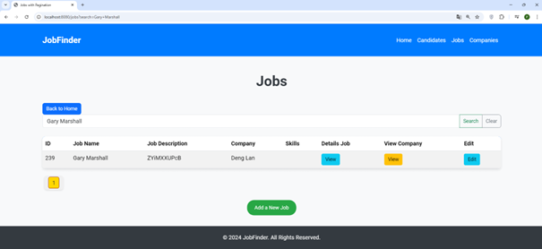

**📄 Giao diện thông tin chi tiết của một công việc**

- Hiển thị đầy đủ thông tin chi tiết của công việc như tên công việc, công ty và các kĩ năng cần thiết.

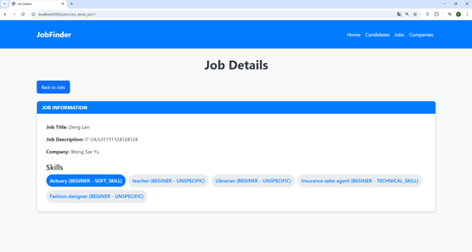

**✏️ Giao diện cập nhật thông tin của một công việc**

- Cho phép nhà tuyển dụng chỉnh sửa thông tin của công việc đã đăng để phù hợp với nhu cầu thực tế.
- Đây là giao diện cho phép nhà tuyển dụng chỉnh sửa thông tin của công việc đã đăng.
- Nhà tuyển dụng có thể thay đổi các thông tin như tên công việc, mô tả, yêu cầu kỹ năng.
- Nút `Select Skills` để chọn kỹ năng yêu cầu cho công việc.
- Sau khi chỉnh sửa xong, để lưu lại thông tin mới, nhấn nút `Update Job`.
- 
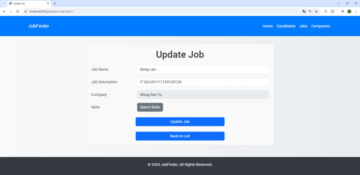
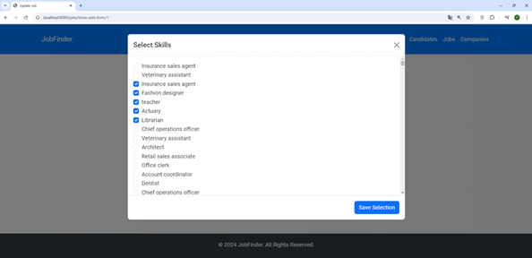

**📊 Giao diện các công việc đang tuyển với một kỹ năng nào đó**

- Hiển thị danh sách công việc phù hợp với kỹ năng được chọn.

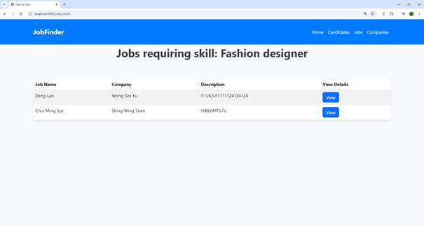

**🧑‍💼 Giao diện gợi ý ứng cử viên phù hợp với công việc đang tuyển**

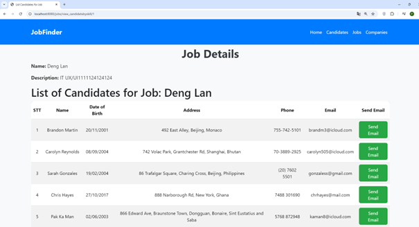

# 🏢 **Companies**
**🖥️ Giao diện chính Companies**

- Hiển thị danh sách các công ty đã đăng ký sử dụng ứng dụng.
- Cho phép tìm kiếm công ty dựa trên tên hoặc lĩnh vực hoạt động.

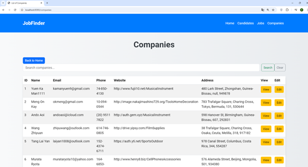
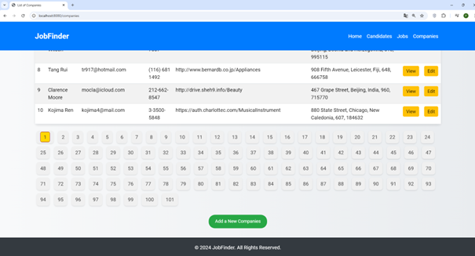

**➕ Giao diện thêm thông tin của một công ty**

- Nhà tuyển dụng có thể thêm thông tin để giới thiệu về công ty, bao gồm tên, địa chỉ, website, mô tả, phone, email.
- Nhấn nút `Add Company` để lưu thông tin mới.
- Nút `Back to List` để quay lại danh sách công ty.
- Sau khi thêm mới, hệ thống sẽ tự động chuyển về trang danh sách công ty.

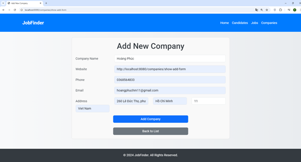

**🔍 Giao diện tìm kiếm thông tin Companies**

- Cho phép tìm kiếm công ty dựa trên tên hoặc lĩnh vực hoạt động.
- Nhập từ khóa tìm kiếm vào ô tìm kiếm.
- Kết quả tìm kiếm sẽ hiển thị dưới dạng danh sách công ty phù hợp.

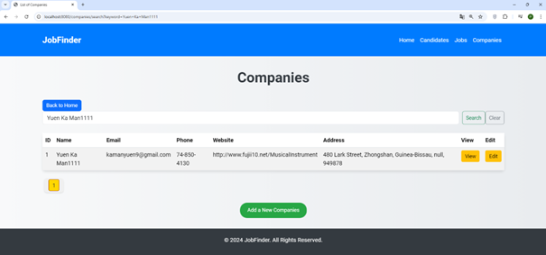

**📄 Giao diện cập nhật thông tin của một công ty**
- Cho phép nhà tuyển dụng chỉnh sửa thông tin của công ty đã đăng.
- Nhà tuyển dụng có thể thay đổi các thông tin như tên, địa chỉ, website, mô tả, phone, email.
- Sau khi chỉnh sửa xong, để lưu lại thông tin mới, nhấn nút

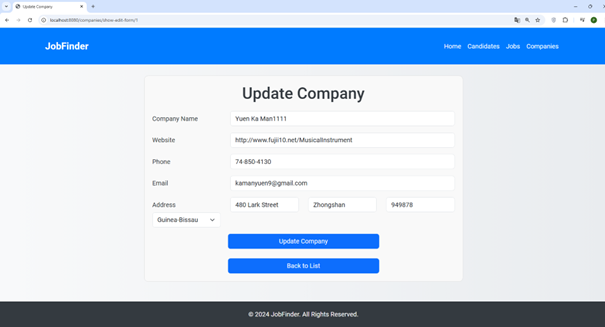

**📄 Giao diện thông tin chi tiết của công ty**

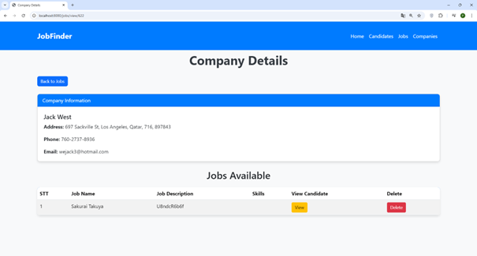

## 📌 Định Hướng Phát Triển

- Phát triển ứng dụng di động cho Android/iOS.
- Tích hợp trí tuệ nhân tạo (AI) để gợi ý thông minh hơn.
- Nâng cấp giao diện bằng React hoặc Vue.js.
- Hỗ trợ đa ngôn ngữ.
- Tối ưu hiệu suất hệ thống.

---

**🌟 Job Finder - Kết nối cơ hội, nâng tầm sự nghiệp!**